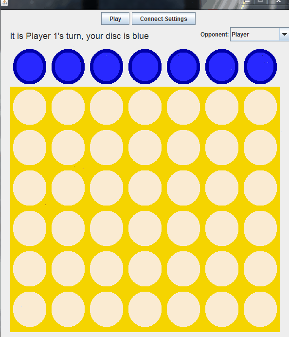

# Connect Four

## Modes

* Player vs Player
* Player vs Random
* Player vs Smart Computer
* Player vs Remote Player

## Demo

 

## Tools

Uses Java Swing for GUI
Sockets for network communication
Sound for winning

## Author
Gerardo Cervantes
